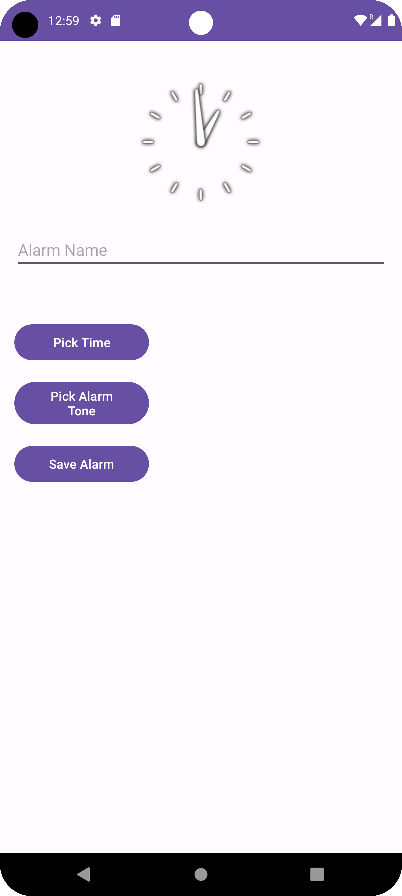
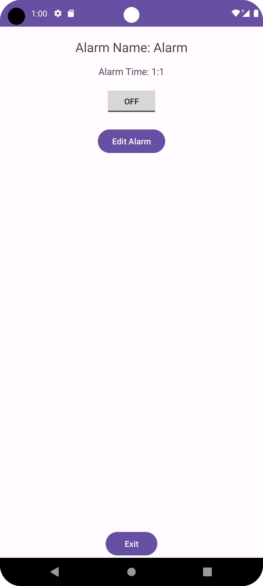
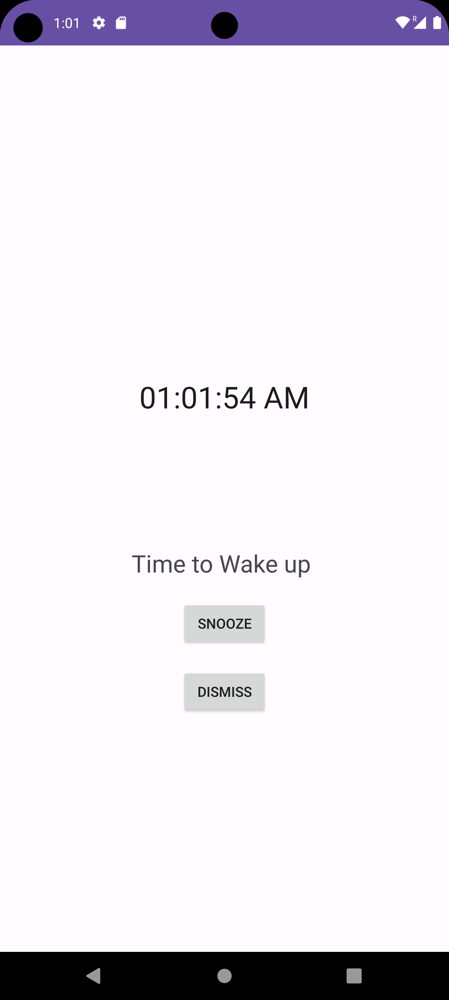

# Alarm Clock App


The Alarm Clock App is designed to help users set and manage alarms with ease. This app features an intuitive interface and includes all the functionalities needed for effective alarm management.

## Table of Contents

- [Features](#features)
- [Screenshots](#screenshots)
- [Installation](#installation)
- [Usage](#usage)
- [Contributing](#contributing)
- [Contact](#contact)

## Features

- **Home Screen**: Display current time and date.
- **Alarm Setting**: Time picker to set the alarm time.
- **Option to Choose Alarm Tone**: Allow users to select the alarm tone.
- **Alarm Management**: set alarms with on/off toggle.
- **Snooze and Dismiss**: Snooze or dismiss the alarm when it rings.
- **User Interface**: User-friendly design.

## Screenshots

<div>
    
    
    
    
</div>

## Installation

### Prerequisites

- Android Studio installed on your machine
- A device or emulator to run the app

### Steps

1. Clone the repository:
    ```bash
    git clone https://github.com/nihalahmed07/CodSoft-Task-3-Alarm-Clock.git
    ```
2. Open the project in Android Studio.
3. Let Android Studio install any required dependencies.
4. Build and run the app on your device or emulator.

## Usage

1. Open the app to view the current time and date.
2. Tap the "Add Alarm" button to set a new alarm.
3. Use the time picker to choose the alarm time.
4. Select the alarm tone from the available options.
5. Save the alarm to see it listed on the home screen.
6. Toggle alarms on or off as needed.
7. When an alarm rings, choose to snooze or dismiss it.

## Contributing

Contributions are welcome! If you'd like to contribute, please fork the repository and use a feature branch. Pull requests are warmly welcomed.

1. Fork the repository.
2. Create a new branch:
    ```bash
    git checkout -b feature/YourFeature
    ```
3. Make your changes.
4. Commit your changes:
    ```bash
    git commit -m 'Add some feature'
    ```
5. Push to the branch:
    ```bash
    git push origin feature/YourFeature
    ```
6. Create a new pull request.

## Contact

Nihal Ahmed - [n.nihalahmed1@gmail.com](mailto:n.nihalahmed1@gmail.com)

Project Link: [Alarm Clock](https://github.com/nihalahmed07/CodSoft-Task-3-Alarm-Clock)
